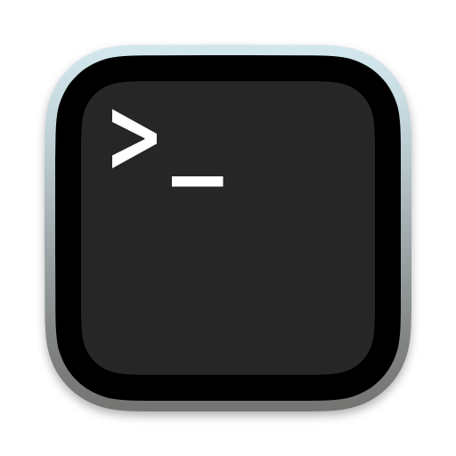
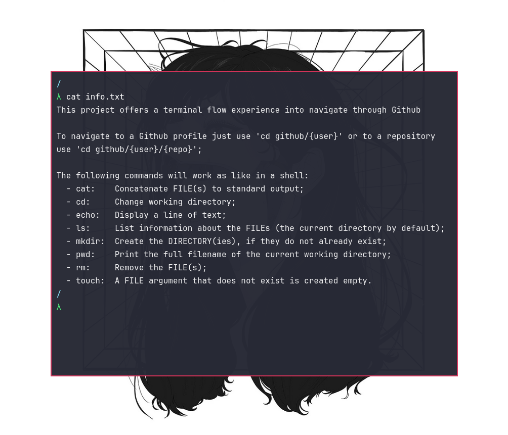

<!-- PROJECT LOGO -->
 

  

  <h3 align="center">Terminal</h3>

<!-- ABOUT THE PROJECT -->
## About The Project

  

 

A Web Application that mimics a terminal and a shell interface. This project provides users a fluid terminal flow experience for navigating through Github, as well as navigate into repositories and profiles, check files as folders.

Just a funny project to blend complexity with the essence of 'yet another GitHub project'.

(<a href="#readme-top">back to top</a>)

